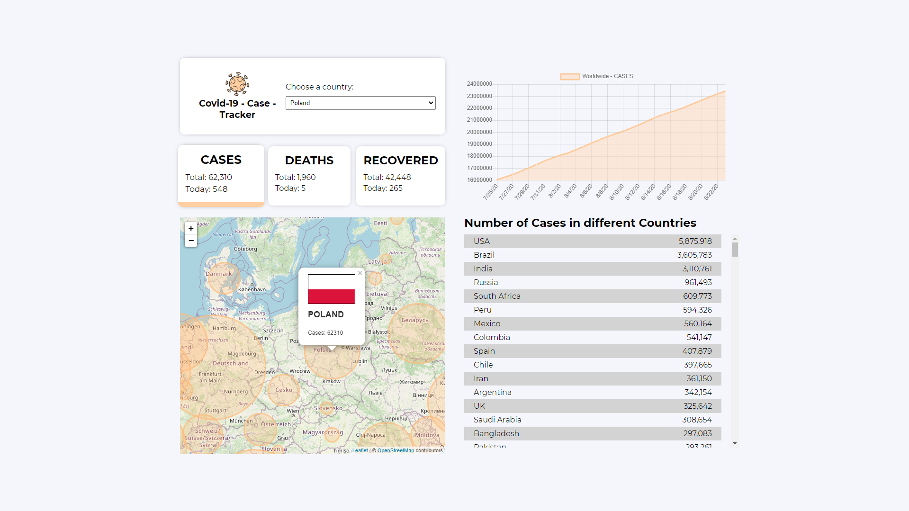
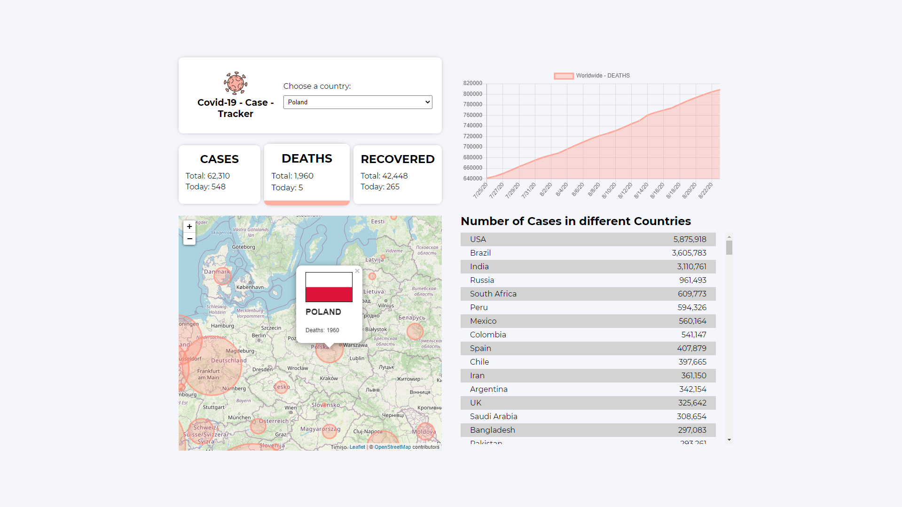
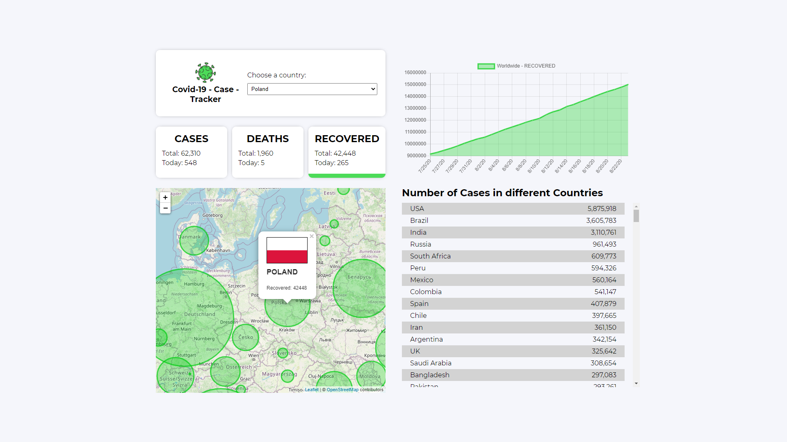
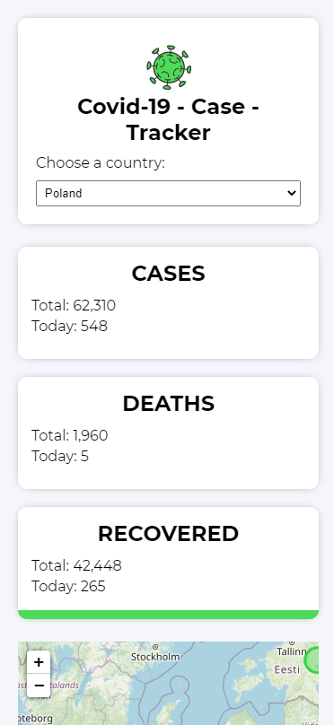
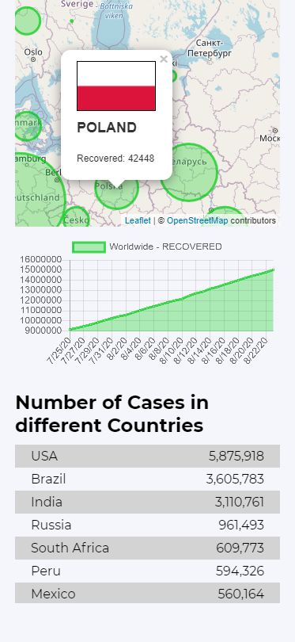

<div style="display: flex;" align="center">


# Covid19-case-tracker

</div>

## Project Overview 🎉

This project was inspired by this <a href="https://www.youtube.com/watch?v=cF3pIMJUZxM">video<a/>. I had different approach to this project than the authors of this video:

- I've used styled-components for styling so I could pass color props to the entire app (look at screenshots).
- I've created custom hooks for App and Chart component (readability),
- I've created new folder for API and added separate functions for fetching data,
- I've added logo (created by me in Figma) which uses color props mentioned above (Nothing epic but I wanted to check if I can pass props to SVG component and dynamicly change the color :D it worked and Im happy with result :D).

## Tech/framework used 🔧

| Name                                                             | Description                                           |
| ---------------------------------------------------------------- | :---------------------------------------------------------------------------------------------: |
| [React](https://reactjs.org/)                                    | Library for building user interfaces                               |
| [Styled Components](https://styled-components.com/)              | Visual primitives for the component age.                             |
| [chart.js](https://www.chartjs.org/)                             | Simple yet flexible JavaScript charting for designers & developers                |
| [react-chartjs-2](https://github.com/jerairrest/react-chartjs-2) | React wrapper for Chart.js                                    |
| [React CountUp](https://www.npmjs.com/package/react-countup)     |Can be used to quickly create animations that display numerical data in a more interesting way. |
| [Leaflet](https://leafletjs.com/)                                | Leaflet is the leading open-source JavaScript library for mobile-friendly interactive maps.   |
| [Figma](https://www.figma.com/)                                  | Vector graphics editor and prototyping tool                           |

## Screenshots 📺




<div style="display:flex;">


</div>

## Installation 💾

```bash
git clone https://github.com/Aroniero/covid19-case-tracker.git
npm install
npm run start
```

## Available scripts :scroll:

| Command         | Description            |
| --------------- | ---------------------- |
| `npm run start` | Open local server      |
| `npm run build` | Create optimized build |
| `npm run test`  | Run tests              |
| `npm run eject` | Eject CRA              |
